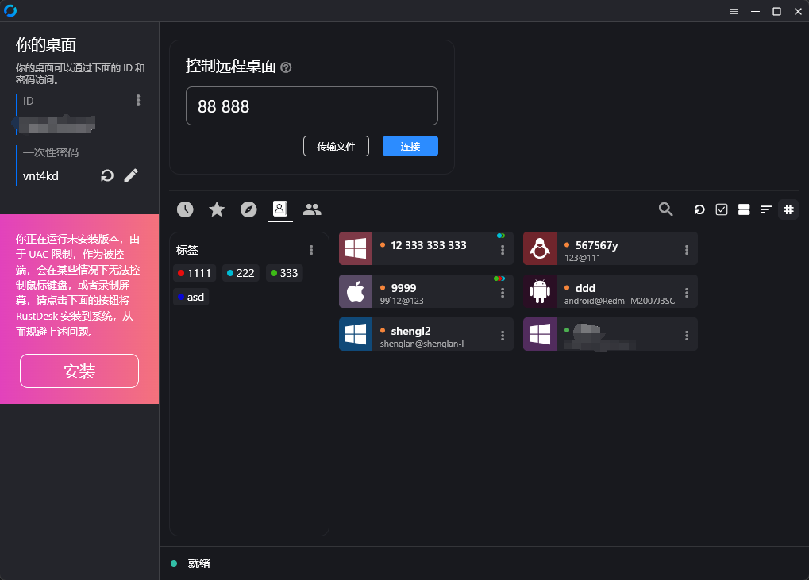

# RustDesk API

[English Doc](README_EN.md)

本仓库基于 `lejianwen/rustdesk-api`，使用 Goravel 1.18 管理 HTTP 生命周期，
并内置服务端渲染的 HTMX 管理界面。RustDesk API 和既有数据库结构保持兼容；
当前验证目标是 RustDesk 1.4.9、rustdesk-server 1.1.16 和 Go 1.25。


<div align=center>


</div>

> **兼容边界：** RustDesk 1.4.9 在同时存在服务器 key 和登录 token 时要求
> secure TCP。官方 rustdesk-server 1.1.16 尚未提供匹配的 API-token 流程，
> 因此本 API 不会绕过 key、签名或 E2EE 验证。详见
> [兼容性说明](docs/rustdesk-compatibility.md)。


# 特性

- PC端API
    - 个人版API
    - 登录
    - 地址簿
    - 群组
    - 授权登录
      - 支持`github`, `google` 和 `OIDC` 登录，
      - 支持`web后台`授权登录
      - 支持`LDAP`(AD和OpenLDAP已测试), 如果API Server配置了LDAP
    - i18n
- Web Admin
    - 内置 Go template + 自托管 HTMX，无需 Node 前端构建
    - 安全的服务器端 session、CSRF、登录限流和验证码
    - 响应式查看和筛选用户、设备、群组、地址簿、标签、审计、告警、token、OAuth、LDAP 和服务器配置
    - 内置用户、群组和 OAuth 管理表单，并可撤销 token；其他写操作继续使用既有的已授权 `/api/admin` API
- CLI
    - 重置管理员密码

部署地址、密码和密钥仅保存在本地忽略的配置中；请参阅[公开仓库配置](docs/public-repository.md)。

## 功能


### API 服务 
基本实现了PC端基础的接口。支持Personal版本接口，可以通过配置文件`rustdesk.personal`或环境变量`RUSTDESK_API_RUSTDESK_PERSONAL`来控制是否启用

<table>
    <tr>
      <td width="50%" align="center" colspan="2"><b>登录</b></td>
    </tr>
    <tr>
        <td width="50%" align="center" colspan="2"></td>
    </tr>
     <tr>
      <td width="50%" align="center"><b>地址簿</b></td>
      <td width="50%" align="center"><b>群组</b></td>
    </tr>
    <tr>
        <td width="50%" align="center"></td>
        <td width="50%" align="center"></td>
    </tr>
</table>

### Web Admin:

* 后台地址：`https://<your server>[:port]/_admin/`。生产环境必须使用 HTTPS。
* 初次安装用户名为 `admin`，随机密码打印到控制台；可使用[命令行](#CLI)重置。
* 新界面可筛选查看用户、设备、群组、地址簿、标签、审计、RustDesk 1.4.9
  告警、token、OAuth、LDAP 和非敏感服务器配置。
* 界面内置用户、群组和 OAuth 的创建、修改、删除表单，并可撤销 token；
  其他写操作仍由既有 `/api/admin` 管理 API 提供。
* 浏览器不保存 API token，页面不显示 RustDesk 私钥、OAuth secret 或 LDAP bind 密码。

### Web Client

在 `/_admin/webclient` 登录后创建指定 RustDesk ID 的一次性访问链接，或通过
`POST /api/webclient/access-tokens` 使用 Bearer token 创建。收件人无需登录后台，
仍须通过远程主机密码或本机批准。浏览器支持加密视频、键盘、鼠标和显示器切换。
链接和中继连接均由 API 服务端限制到单一 ID；旧版不受保护的分享接口仍不启用。
详见 [Web Client API、部署和验证说明](docs/webclient.md)。
外部系统可在 `/_admin/integration-tokens` 创建专用 API token，设置允许的 ID、
有效期及撤销；完整密钥仅创建时显示一次，服务端仅保存哈希。


### 自动化文档: 使用 Swag 生成 API 文档，方便开发者理解和使用 API。

1. 后台文档 `<youer server[:port]>/admin/swagger/index.html`
2. PC端文档 `<youer server[:port]>/swagger/index.html`
   

### CLI

```bash
# 查看帮助
./apimain -h
```

#### 重置管理员密码
```bash
./apimain reset-admin-pwd <pwd>
```

## 安装与运行

### 相关配置

* [配置文件](./conf/config.yaml)
* 参考`conf/config.yaml`配置文件，修改相关配置。
* 如果`gorm.type`是`sqlite`，则不需要配置mysql相关配置。
* 语言如果不设置默认为`zh-CN`

### 环境变量
环境变量和配置文件`conf/config.yaml`中的配置一一对应，变量名前缀是`RUSTDESK_API`
下面表格并未全部列出，可以参考`conf/config.yaml`中的配置。

| 变量名                                                    | 说明                                                                             | 示例                           |
|--------------------------------------------------------|--------------------------------------------------------------------------------|------------------------------|
| TZ                                                     | 时区                                                                             | Asia/Shanghai                |
| RUSTDESK_API_LANG                                      | 语言                                                                             | `en`,`zh-CN`                 |
| RUSTDESK_API_APP_REGISTER                              | 是否开启注册; `true`, `false`  默认`false`                                             | `false`                      |
| RUSTDESK_API_APP_SHOW_SWAGGER                          | 是否可见swagger文档;`1`显示，`0`不显示，默认`0`不显示                                            | `1`                          |
| RUSTDESK_API_APP_TOKEN_EXPIRE                          | token有效时长                                                                      | `168h`                       |
| RUSTDESK_API_APP_DISABLE_PWD_LOGIN                     | 是否禁用密码登录;  `true`, `false`  默认`false`                                          | `false`                      |
| RUSTDESK_API_APP_REGISTER_STATUS                       | 注册用户默认状态; 1 启用，2 禁用, 默认 1                                                      | `1`                          |
| RUSTDESK_API_APP_CAPTCHA_THRESHOLD                     | 验证码触发次数; -1 不启用， 0 一直启用， >0 登录错误次数后启用 ;默认 `3`                                  | `3`                          |
| RUSTDESK_API_APP_BAN_THRESHOLD                         | 封禁IP触发次数; 0 不启用, >0 登录错误次数后封禁IP; 默认 `0`                                        | `0`                          |
| -----ADMIN配置-----                                      | ----------                                                                     | ----------                   |
| RUSTDESK_API_ADMIN_TITLE                               | 后台标题                                                                           | `RustDesk Api Admin`         |
| RUSTDESK_API_ADMIN_HELLO                               | 后台欢迎语，可以使用`html`                                                               |                              |
| RUSTDESK_API_ADMIN_HELLO_FILE                          | 后台欢迎语文件，如果内容多，使用文件更方便。<br>会覆盖`RUSTDESK_API_ADMIN_HELLO`                        | `./conf/admin/hello.html`    |
| -----GIN配置-----                                        | ----------                                                                     | ----------                   |
| RUSTDESK_API_GIN_TRUST_PROXY                           | 信任的代理IP列表，以`,`分割，默认信任所有                                                        | 192.168.1.2,192.168.1.3      |
| -----GORM配置-----                                       | ----------                                                                     | ---------------------------  |
| RUSTDESK_API_GORM_TYPE                                 | 数据库类型sqlite或者mysql，默认sqlite                                                    | sqlite                       |
| RUSTDESK_API_GORM_MAX_IDLE_CONNS                       | 数据库最大空闲连接数                                                                     | 10                           |
| RUSTDESK_API_GORM_MAX_OPEN_CONNS                       | 数据库最大打开连接数                                                                     | 100                          |
| RUSTDESK_API_RUSTDESK_PERSONAL                         | 是否启用个人版API， 1:启用,0:不启用； 默认启用                                                   | 1                            |
| -----MYSQL配置-----                                      | ----------                                                                     | ----------                   |
| RUSTDESK_API_MYSQL_USERNAME                            | mysql用户名                                                                       | root                         |
| RUSTDESK_API_MYSQL_PASSWORD                            | mysql密码                                                                        | YOUR_DATABASE_PASSWORD                       |
| RUSTDESK_API_MYSQL_ADDR                                | mysql地址                                                                        | mysql.example.com:3306            |
| RUSTDESK_API_MYSQL_DBNAME                              | mysql数据库名                                                                      | rustdesk                     |
| RUSTDESK_API_MYSQL_TLS                             | 是否启用TLS, 可选值: `true`, `false`, `skip-verify`, `custom` | `false`                      |
| -----RUSTDESK配置-----                                   | ----------                                                                     | ----------                   |
| RUSTDESK_API_RUSTDESK_ID_SERVER                        | Rustdesk的id服务器地址                                                               | rustdesk.example.com:21116           |
| RUSTDESK_API_RUSTDESK_RELAY_SERVER                     | Rustdesk的relay服务器地址                                                            | rustdesk.example.com:21117           |
| RUSTDESK_API_RUSTDESK_API_SERVER                       | Rustdesk的api服务器地址                                                              | http://rustdesk.example.com:21114    |
| RUSTDESK_API_RUSTDESK_KEY                              | Rustdesk的key                                                                   | YOUR_RUSTDESK_PUBLIC_KEY                    |
| RUSTDESK_API_RUSTDESK_KEY_FILE                         | Rustdesk存放key的文件                                                               | `./conf/data/id_ed25519.pub` |
| RUSTDESK_API_RUSTDESK_WS_HOST                          | 自定义Websocket Host                                                              | `wss://rustdesk.example.com:443`   |
| ----PROXY配置-----                                       | ----------                                                                     | ----------                   |
| RUSTDESK_API_PROXY_ENABLE                              | 是否启用代理:`false`, `true`                                                         | `false`                      |
| RUSTDESK_API_PROXY_HOST                                | 代理地址                                                                           | `http://127.0.0.1:1080`      |
| ----JWT配置----                                          | --------                                                                       | --------                     |
| RUSTDESK_API_JWT_KEY                                   | 自定义JWT KEY,为空则不启用JWT<br/>如果没使用`lejianwen/rustdesk-server`中的`MUST_LOGIN`，建议设置为空 |                              |
| RUSTDESK_API_JWT_EXPIRE_DURATION                       | JWT有效时间                                                                        | `168h`                       |


### 运行

#### docker运行

1. 直接docker运行,配置可以通过挂载配置文件`/app/conf/config.yaml`来修改,或者通过环境变量覆盖配置文件中的配置

    ```bash
    docker build -f Dockerfile.dev -t rustdesk-api-goravel:v3.0.1 .
    docker run -d --name rustdesk-api -p 21114:21114 \
    -v /data/rustdesk/api:/app/data \
    -e TZ=Asia/Shanghai \
    -e RUSTDESK_API_LANG=zh-CN \
    -e RUSTDESK_API_RUSTDESK_ID_SERVER=rustdesk.example.com:21116 \
    -e RUSTDESK_API_RUSTDESK_RELAY_SERVER=rustdesk.example.com:21117 \
    -e RUSTDESK_API_RUSTDESK_API_SERVER=http://rustdesk.example.com:21114 \
    -e RUSTDESK_API_RUSTDESK_KEY=<key> \
    rustdesk-api-goravel:v3.0.1
    ```

2. 使用 `docker compose`，参考仓库内的 [`docker-compose-dev.yaml`](docker-compose-dev.yaml)

#### 下载release直接运行

[下载地址](https://github.com/slxar/rustdesk-api-goravel/releases)

#### 源码安装

1. 克隆仓库
   ```bash
   git clone https://github.com/slxar/rustdesk-api-goravel.git
   cd rustdesk-api-goravel
   ```

2. 安装依赖并编译（需要 Go 1.25）

    ```bash
    go mod download
    go build -o apimain ./cmd
    ```

3. 运行（HTMX 和管理模板已经包含在仓库中，无需 Node 构建）
    ```bash
    ./apimain
    ```
   > 注意：使用 `go run` 或编译后的二进制时，当前目录下必须存在 `conf`、`public` 和 `resources`
   > 目录。如果在其他目录运行，可通过 `-c` 和环境变量
   > `RUSTDESK_API_GIN_RESOURCES_PATH` 指定绝对路径，例如：
   > ```bash
   > RUSTDESK_API_GIN_RESOURCES_PATH=/opt/rustdesk-api/resources ./apimain -c /opt/rustdesk-api/conf/config.yaml
   > ```
4. 跨平台编译可在项目根目录运行 `build.bat` 或 `build.sh`，产物位于 `release`
   目录下生成对应的可执行文件。直接运行编译后的可执行文件即可。

5. 打开浏览器访问 `https://<your server[:port]>/_admin/`，使用控制台打印的随机密码登录并及时更改密码。


#### 使用`lejianwen/server-s6`镜像运行

- 已解决链接超时问题
- 可以强制登录后才能发起链接
- github https://github.com/lejianwen/rustdesk-server

```yaml
 networks:
   rustdesk-net:
     external: false
 services:
   rustdesk:
     ports:
       - 21114:21114
       - 21115:21115
       - 21116:21116
       - 21116:21116/udp
       - 21117:21117
       - 21118:21118
       - 21119:21119
     image: lejianwen/rustdesk-server-s6:latest
     environment:
       - RELAY=<relay_server[:port]>
       - ENCRYPTED_ONLY=1
       - MUST_LOGIN=N
       - TZ=Asia/Shanghai
       - RUSTDESK_API_RUSTDESK_ID_SERVER=<id_server[:21116]>
       - RUSTDESK_API_RUSTDESK_RELAY_SERVER=<relay_server[:21117]>
       - RUSTDESK_API_RUSTDESK_API_SERVER=http://<api_server[:21114]>
       - RUSTDESK_API_KEY_FILE=/data/id_ed25519.pub
       - RUSTDESK_API_JWT_KEY=${RUSTDESK_JWT_KEY} # jwt key
     volumes:
       - /data/rustdesk/server:/data
       - /data/rustdesk/api:/app/data #将数据库挂载
     networks:
       - rustdesk-net
     restart: unless-stopped
       
```


## 其他

- [WIKI](https://github.com/lejianwen/rustdesk-api/wiki)
- [链接超时问题](https://github.com/lejianwen/rustdesk-api/issues/92)
- [修改客户端ID](https://github.com/abdullah-erturk/RustDesk-ID-Changer)


## 鸣谢

感谢所有做过贡献的人!

<a href="https://github.com/lejianwen/rustdesk-api/graphs/contributors">
  
</a>

## 感谢你的支持！如果这个项目对你有帮助，请点个⭐️鼓励一下，谢谢！

[lejianwen/rustdesk-server]: https://github.com/lejianwen/rustdesk-server
