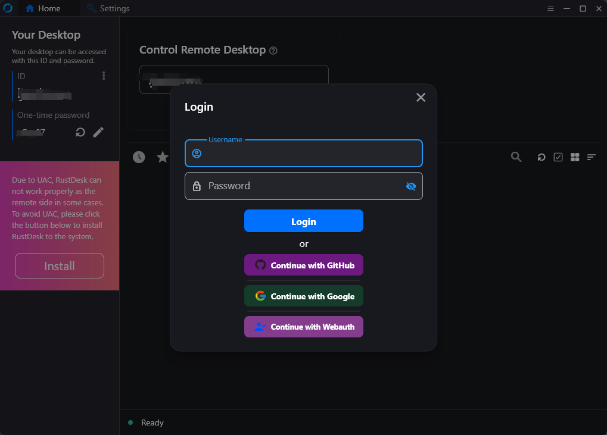
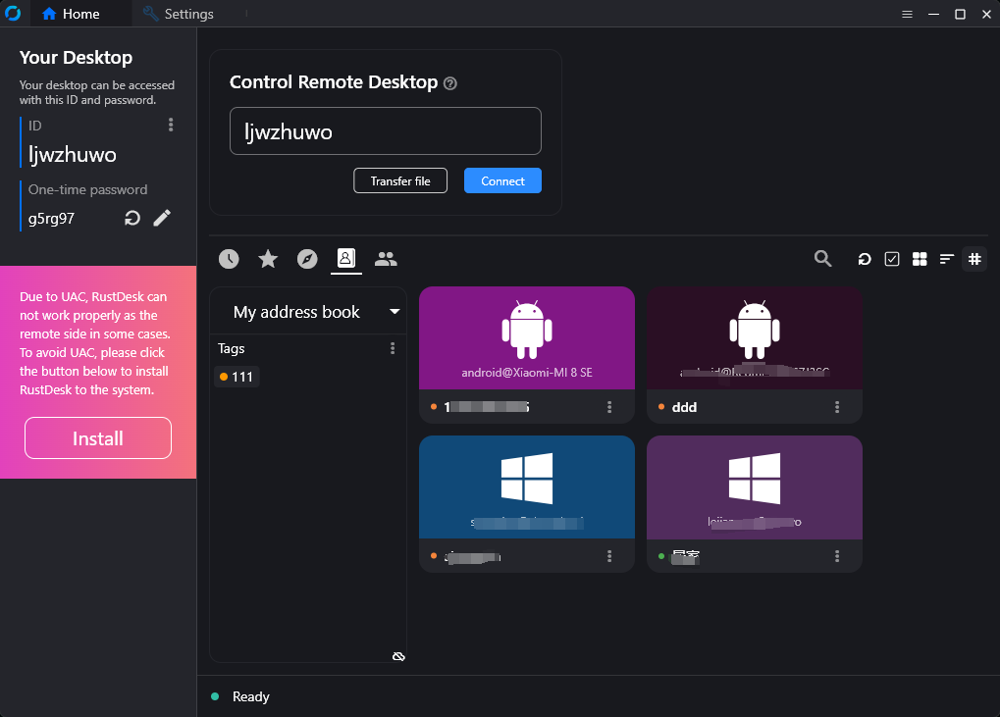
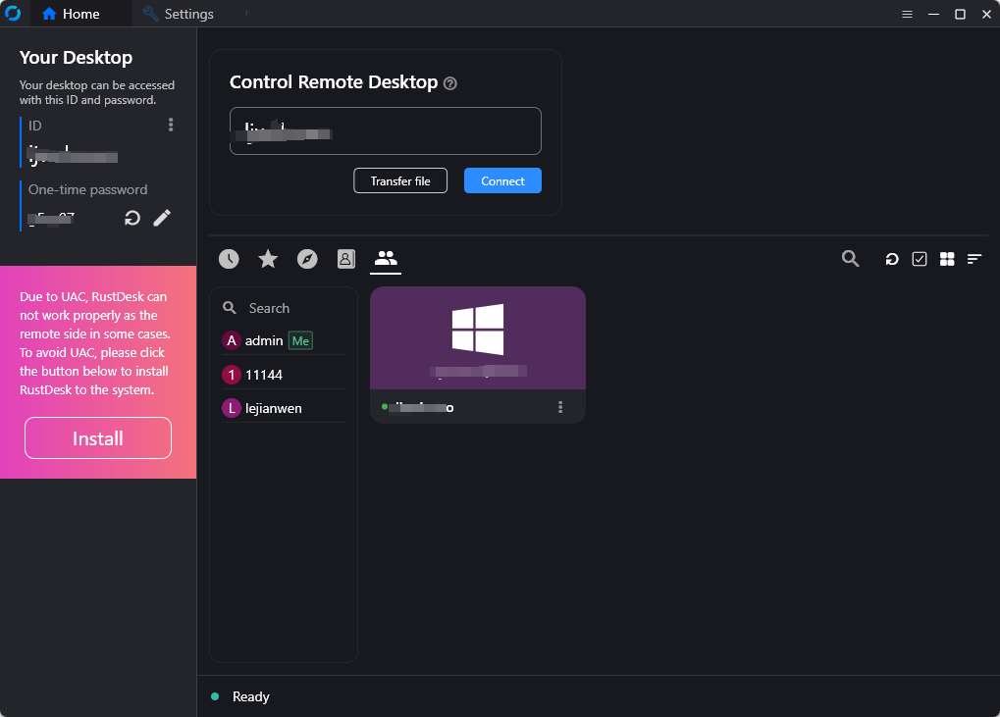
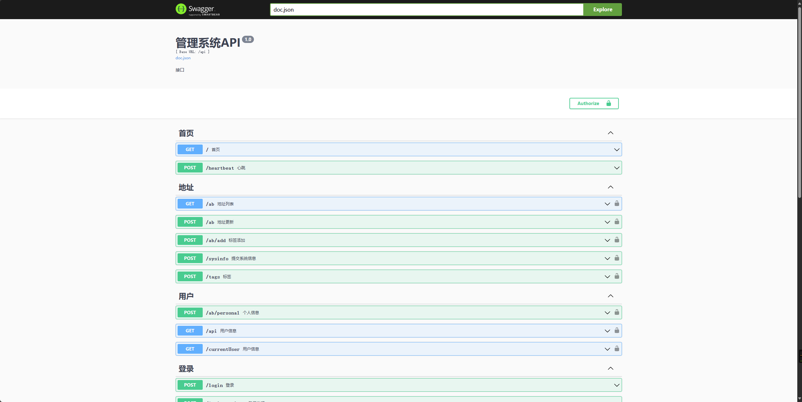

# RustDesk API

This fork modernizes `lejianwen/rustdesk-api`: Goravel 1.18 owns the HTTP
lifecycle and an in-repository, server-rendered HTMX admin replaces the external
SPA build. It targets RustDesk 1.4.9, rustdesk-server 1.1.16 and Go 1.25 while
preserving the inherited API and database contract.

<div align=center>


</div>

> **Compatibility boundary:** RustDesk 1.4.9 requires secure TCP whenever both
> a server key and login token are present. Official rustdesk-server 1.1.16 does
> not implement the matching API-token flow. This API never bypasses key,
> signature, or E2EE verification. See [compatibility](docs/rustdesk-compatibility.md).


# Features

- PC API
    - Personal API
    - Login
    - Address Book
    - Groups
    - Authorized login, 
      - supports `GitHub`, `Google` and `OIDC` login, 
      - supports `web admin` authorized login, 
      - supports LDAP(test AD and openladp) if API Server config
    - i18n
- Web Admin
    - In-repository Go templates and self-hosted HTMX; no Node build
    - Server-side sessions, CSRF, login throttling, and captcha
    - Responsive, filterable views for users, peers, groups, address books,
      tags, audits, alarms, tokens, OAuth, LDAP, and safe server settings
    - Built-in user, group, and OAuth forms plus token revocation; inherited
      authorized `/api/admin` endpoints retain the remaining mutations
- CLI
    - Reset admin password

## Overview

### API Service
Basic implementation of the PC client's primary interfaces.Supports the Personal version api, which can be enabled by configuring the `rustdesk.personal` file or the `RUSTDESK_API_RUSTDESK_PERSONAL` environment variable.

<table>
    <tr>
      <td width="50%" align="center" colspan="2"><b>Login</b></td>
    </tr>
    <tr>
        <td width="50%" align="center" colspan="2"></td>
    </tr>
     <tr>
      <td width="50%" align="center"><b>Address Book</b></td>
      <td width="50%" align="center"><b>Groups</b></td>
    </tr>
    <tr>
        <td width="50%" align="center"></td>
        <td width="50%" align="center"></td>
    </tr>
</table>

### Web Admin

* URL: `https://<your server[:port]>/_admin/`. Production use requires HTTPS.
* The initial username is `admin`; a random password is printed to the console
  and can be reset with the [CLI](#cli).
* The built-in UI filters users, peers, groups, address books, tags, audits,
  RustDesk 1.4.9 alarms, tokens, OAuth, LDAP status, and non-secret server settings.
* It provides user, group, and OAuth create/update/delete forms plus token
  revocation. Existing `/api/admin` endpoints retain all other authorized
  mutations. The browser stores no API token and list/config pages omit private
  keys, OAuth secrets, and LDAP bind credentials.
  
### Legacy Web Client

Legacy browser web-client routes are no longer registered; retained resource
files are not served.

### Automated Documentation : API documentation is generated using Swag, making it easier for developers to understand and use the API.

1. Admin panel docs: `<your server[:port]>/admin/swagger/index.html`
2. PC client docs: `<your server[:port]>/swagger/index.html`
   

### CLI
```bash
# help
./apimain -h
```

#### Reset admin password
```bash
./apimain reset-admin-pwd <pwd>
```

## Installation and Setup

### Configuration

* [Config File](./conf/config.yaml)
* Modify the configuration in `conf/config.yaml`. 
* If `gorm.type` is set to `sqlite`, MySQL-related configurations are not required.
* Language support: `en` and `zh-CN` are supported. The default is `zh-CN`.


### Environment Variables
The environment variables correspond one-to-one with the configurations in the `conf/config.yaml` file. The prefix for variable names is `RUSTDESK_API`.
The table below does not list all configurations. Please refer to the configurations in `conf/config.yaml`.

| Variable Name                                          | Description                                                                                                                                         | Example                       |
|--------------------------------------------------------|-----------------------------------------------------------------------------------------------------------------------------------------------------|-------------------------------|
| TZ                                                     | timezone                                                                                                                                            | Asia/Shanghai                 |
| RUSTDESK_API_LANG                                      | Language                                                                                                                                            | `en`,`zh-CN`                  |
| RUSTDESK_API_APP_REGISTER                              | register enable; `true`, `false`; default:`false`                                                                                                   | `false`                       |
| RUSTDESK_API_APP_SHOW_SWAGGER                          | swagger visible; 1: yes, 0: no; default: 0                                                                                                          | `0`                           |
| RUSTDESK_API_APP_TOKEN_EXPIRE                          | token expire duration                                                                                                                               | `168h`                        |
| RUSTDESK_API_APP_DISABLE_PWD_LOGIN                     | disable password login                                                                                                                              | `false`                       |
| RUSTDESK_API_APP_REGISTER_STATUS                       | register user default status ; 1 enabled , 2 disabled ; default 1                                                                                   | `1`                           |
| RUSTDESK_API_APP_CAPTCHA_THRESHOLD                     | captcha threshold; -1 disabled, 0 always enable, >0 threshold  ;default `3`                                                                         | `3`                           |
| RUSTDESK_API_APP_BAN_THRESHOLD                         | ban ip threshold; 0 disabled, >0 threshold ; default `0`                                                                                            | `0`                           |
| ----- ADMIN Configuration-----                         | ----------                                                                                                                                          | ----------                    |
| RUSTDESK_API_ADMIN_TITLE                               | Admin Title                                                                                                                                         | `RustDesk Api Admin`          |
| RUSTDESK_API_ADMIN_HELLO                               | Admin welcome message, you can use `html`                                                                                                           |                               |
| RUSTDESK_API_ADMIN_HELLO_FILE                          | Admin welcome message file,<br>will override `RUSTDESK_API_ADMIN_HELLO`                                                                             | `./conf/admin/hello.html`     |
| ----- GIN Configuration -----                          | ---------------------------------------                                                                                                             | ----------------------------- |
| RUSTDESK_API_GIN_TRUST_PROXY                           | Trusted proxy IPs, separated by commas.                                                                                                             | 192.168.1.2,192.168.1.3       |
| ----- GORM Configuration -----                         | ---------------------------------------                                                                                                             | ----------------------------- |
| RUSTDESK_API_GORM_TYPE                                 | Database type (`sqlite` or `mysql`). Default is `sqlite`.                                                                                           | sqlite                        |
| RUSTDESK_API_GORM_MAX_IDLE_CONNS                       | Maximum idle connections                                                                                                                            | 10                            |
| RUSTDESK_API_GORM_MAX_OPEN_CONNS                       | Maximum open connections                                                                                                                            | 100                           |
| RUSTDESK_API_RUSTDESK_PERSONAL                         | Open Personal Api 1:Enable,0:Disable                                                                                                                | 1                             |
| ----- MYSQL Configuration -----                        | ---------------------------------------                                                                                                             | ----------------------------- |
| RUSTDESK_API_MYSQL_USERNAME                            | MySQL username                                                                                                                                      | root                          |
| RUSTDESK_API_MYSQL_PASSWORD                            | MySQL password                                                                                                                                      | YOUR_DATABASE_PASSWORD                        |
| RUSTDESK_API_MYSQL_ADDR                                | MySQL address                                                                                                                                       | mysql.example.com:3306             |
| RUSTDESK_API_MYSQL_DBNAME                              | MySQL database name                                                                                                                                 | rustdesk                      |
| RUSTDESK_API_MYSQL_TLS                             | Whether to enable TLS, optional values: `true`, `false`, `skip-verify`, `custom` | `false`                       |
| ----- RUSTDESK Configuration -----                     | ---------------------------------------                                                                                                             | ----------------------------- |
| RUSTDESK_API_RUSTDESK_ID_SERVER                        | Rustdesk ID server address                                                                                                                          | rustdesk.example.com:21116            |
| RUSTDESK_API_RUSTDESK_RELAY_SERVER                     | Rustdesk relay server address                                                                                                                       | rustdesk.example.com:21117            |
| RUSTDESK_API_RUSTDESK_API_SERVER                       | Rustdesk API server address                                                                                                                         | http://rustdesk.example.com:21114     |
| RUSTDESK_API_RUSTDESK_KEY                              | Rustdesk key                                                                                                                                        | YOUR_RUSTDESK_PUBLIC_KEY                     |
| RUSTDESK_API_RUSTDESK_KEY_FILE                         | Rustdesk key file                                                                                                                                   | `./conf/data/id_ed25519.pub`  |
| RUSTDESK_API_RUSTDESK_WS_HOST                          | Custom Websocket Host                                                                                                                               | `wss://rustdesk.example.com:443`    |
| ---- PROXY -----                                       | ---------------                                                                                                                                     | ----------                    |
| RUSTDESK_API_PROXY_ENABLE                              | proxy_enable :`false`, `true`                                                                                                                       | `false`                       |
| RUSTDESK_API_PROXY_HOST                                | proxy_host                                                                                                                                          | `http://127.0.0.1:1080`       |
| ----JWT----                                            | --------                                                                                                                                            | --------                      |
| RUSTDESK_API_JWT_KEY                                   | Custom JWT KEY, if empty JWT is not enabled.<br/>If `MUST_LOGIN` from `lejianwen/rustdesk-server` is not used, it is recommended to leave it empty. |                               |
| RUSTDESK_API_JWT_EXPIRE_DURATION                       | JWT expire duration                                                                                                                                 | `168h`                        |

### Installation Steps

#### Running via Docker

1. Run directly with Docker. Configuration can be modified by mounting the config file `/app/conf/config.yaml`, or by
   using environment variables to override settings.
    
    ```bash
    docker build -f Dockerfile.dev -t rustdesk-api-goravel:v3.0.1 .
    docker run -d --name rustdesk-api -p 21114:21114 \
    -v /data/rustdesk/api:/app/data \
    -e RUSTDESK_API_LANG=en \
    -e RUSTDESK_API_RUSTDESK_ID_SERVER=rustdesk.example.com:21116 \
    -e RUSTDESK_API_RUSTDESK_RELAY_SERVER=rustdesk.example.com:21117 \
    -e RUSTDESK_API_RUSTDESK_API_SERVER=http://rustdesk.example.com:21114 \
    -e RUSTDESK_API_RUSTDESK_KEY=${RUSTDESK_PUBLIC_KEY} \
    rustdesk-api-goravel:v3.0.1
    ```

2. For Compose, use the repository's [`docker-compose-dev.yaml`](docker-compose-dev.yaml).
   Set `RUSTDESK_ID_SERVER`, `RUSTDESK_RELAY_SERVER`, `RUSTDESK_API_ORIGIN` and
   `RUSTDESK_PUBLIC_KEY` in your shell or a local ignored `.env` file first.
   See [public repository configuration](docs/public-repository.md).

#### Running from Release

Download releases from [GitHub](https://github.com/slxar/rustdesk-api-goravel/releases).

#### Source Installation

1. Clone the repository:
   ```bash
   git clone https://github.com/slxar/rustdesk-api-goravel.git
   cd rustdesk-api-goravel
   ```

2. Download dependencies and build (Go 1.25 is required):

    ```bash
    go mod download
    go build -o apimain ./cmd
    ```

3. Run. HTMX and the admin templates are included; no Node build is required.
    ```bash
   ./apimain
   ```
   > **Note:** When using `go run` or the compiled binary, the `conf`, `public`, and `resources`
   > directories must exist relative to the current working directory. If you run
   > the program from another location, specify absolute paths with `-c` and the
   > `RUSTDESK_API_GIN_RESOURCES_PATH` environment variable. Example:
   > ```bash
   > RUSTDESK_API_GIN_RESOURCES_PATH=/opt/rustdesk-api/resources ./apimain -c /opt/rustdesk-api/conf/config.yaml
   > ```

4. For cross-platform release builds, run `build.bat` or `build.sh`. After
   compiling, the corresponding executables will be generated in the `release` directory. Run the compiled executables
   directly.

5. Open `https://<your server[:port]>/_admin/` and sign in with the random
   password printed at first startup. Change it immediately.

#### Running with my forked server-s6 image

- Connection timeout issue resolved
- Can enforce login before initiating a connection
- github https://github.com/lejianwen/rustdesk-server

```yaml
 networks:
   rustdesk-net:
     external: false
 services:
   rustdesk:
     ports:
       - 21114:21114
       - 21115:21115
       - 21116:21116
       - 21116:21116/udp
       - 21117:21117
       - 21118:21118
       - 21119:21119
     image: lejianwen/rustdesk-server-s6:latest
     environment:
       - RELAY=<relay_server[:port]>
       - ENCRYPTED_ONLY=1
       - MUST_LOGIN=N
       - TZ=Asia/Shanghai
       - RUSTDESK_API_RUSTDESK_ID_SERVER=<id_server[:21116]>
       - RUSTDESK_API_RUSTDESK_RELAY_SERVER=<relay_server[:21117]>
       - RUSTDESK_API_RUSTDESK_API_SERVER=http://<api_server[:21114]>
       - RUSTDESK_API_KEY_FILE=/data/id_ed25519.pub
       - RUSTDESK_API_JWT_KEY=${RUSTDESK_JWT_KEY} # jwt key
     volumes:
       - /data/rustdesk/server:/data
       - /data/rustdesk/api:/app/data #将数据库挂载
     networks:
       - rustdesk-net
     restart: unless-stopped
       
```
## Others

- [WIKI](https://github.com/lejianwen/rustdesk-api/wiki)
- [Connection Timeout](https://github.com/lejianwen/rustdesk-api/issues/92)
- [Change client ID](https://github.com/abdullah-erturk/RustDesk-ID-Changer)

## Acknowledgements

Thanks to everyone who contributed!

<a href="https://github.com/lejianwen/rustdesk-api/graphs/contributors">
  
</a>

## Thanks for your support! If you find this project useful, please give it a ⭐️. Thank you!


[lejianwen/rustdesk-server]: https://github.com/lejianwen/rustdesk-server
